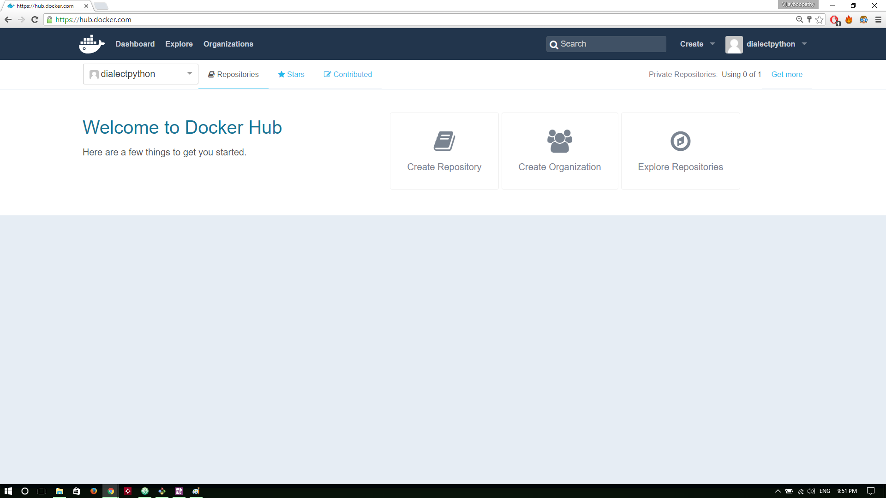

# Dockerizing your Applications : Building Images and Working with Registries  
In the previous session, we have learnt about various container operations such as running containers from
pre built images, port mapping, inspecting and updating containers, limiting resources etc., In this
chapter, we are going to learn about how to build containers for your individual applications, as well
as how to work with docker hub registry to host and distribute the images.

### Lab: Registering with the DockerHub   
Since we are going to start working with the registry, build and push images to it later, its essential to have our own account on the registry. For the purpose of this tutorial, we are going to use the hosted registry i.e. Dockerhub.

Steps to create Dockerhub account

#### Step 1:  
Visit the following link and sign up with your email id  
  **https://hub.docker.com/**

  

#### Step 2:  
Check your email inbox and check the activation email sent by docker team

#### Step 3:  
After clicking on the activation link, you will be redirected to a log in page. Enter your credentials and log in

  

You will be launched to Dockerhub main page. Now the registration process is complete and you have account in Dockerhub!

  

## Lab: Building Docker Images - A manual approach  
Before we start building automated images, we are going to create a docker image by hand. We have already used the pre built image from the registry in the last session. In this session, however, we are going to create our own image with ghost installed. Since Ghost is a node.js based application, we will base our work on existing official image for **node**


#### Clone Repository for Java worker app

```
git clone https://github.com/schoolofdevops/voting-app-worker.git
```

#### Launch a intermediate container to install worker app

Create a Container with  **schoolofdevops/voteapp-mvn:v1** image

```
docker run -idt --name interim schoolofdevops/voteapp-mvn  sh

```

#### Copy over the Source Code


```
cd voting-app-worker
docker container cp .  interim:/code

```

Connect to container to compile and package the code


```
docker exec -it interim sh

mvn package

```

#### Verify jarfile has been built

```
ls target/

java -jar target/worker-jar-with-dependencies.jar
```

Move the artifact, remove source code
```

mv target/worker-jar-with-dependencies.jar /run/worker.jar

rm -rf /code/*
```

[output]
```
Waiting for redis
Waiting for redis
Waiting for redis
Waiting for redis
^C
```

[use ^c to exit]

The above is the expected output. The **worker** app keeps waiting for **redis** and then later **db** in a loop.

Lets now move this app to somewhere else and delete the source code

```
Waiting for redis
Waiting for redis
Waiting for redis
Waiting for redis
^C
```


Commit  container to an image

  * Exit from the container shell
  * Note container ID

Commit the container into a image  as,

```

docker container commit interim  <docker hub user id >/worker:v1

```

Test before pushing  by launching container with the packaged app

```
  docker run --rm -it  <docker hub user id >/worker:v1 java -jar /run/worker.jar
```

##### Push Image to registry

Before you push the image, you need to be logged in to the registry, with the docker hub id created earlier. Login using the following command,

```
docker login
```

To push the image, first list it,

```
docker image ls
```

[Sample Output]

```
REPOSITORY                   TAG                 IMAGE ID            CREATED             SIZE
initcron/worker         v2              90cbeb6539df        18 minutes ago      194MB
initcron/worker         v1              c0199f782489        34 minutes ago      189MB

```

To push the image,


```
docker push <dockrhub user id>/worker:v1
```


## Lab: Building Images with Dockerfile

Now, lets build the same image, this time with Dockerfile. To do this, create a file by name **Dockerfile** in the root of the source code.

file: Dockerfile

```
FROM schoolofdevops/maven

WORKDIR /app

COPY .  .

RUN mvn package && \
    mv target/worker-jar-with-dependencies.jar /run/worker.jar && \
    rm -rf /app/*

CMD java  -jar /run/worker.jar

```


Lets now build the image

```
docker image build -t <dockrhub user id>/worker:v2 .

docker image ls

```

Try building again,

```
docker image build -t <dockrhub user id>/worker:v2 .

```

This time, it does not build everything, but uses cache.


Testing the image

```
docker container run --rm -it  <dockrhub user id>/worker:v2

```


Tag the image as latest,

```
docker image tag  <dockrhub user id>/worker:v2  <dockrhub user id>/worker:latest

docker image ls

```

Finally, publish it to the registry,

```
docker image push <dockrhub user id>/worker:latest

docker image push <dockrhub user id>/worker

```


### References

Building Base Images: https://docs.docker.com/develop/develop-images/baseimages/
